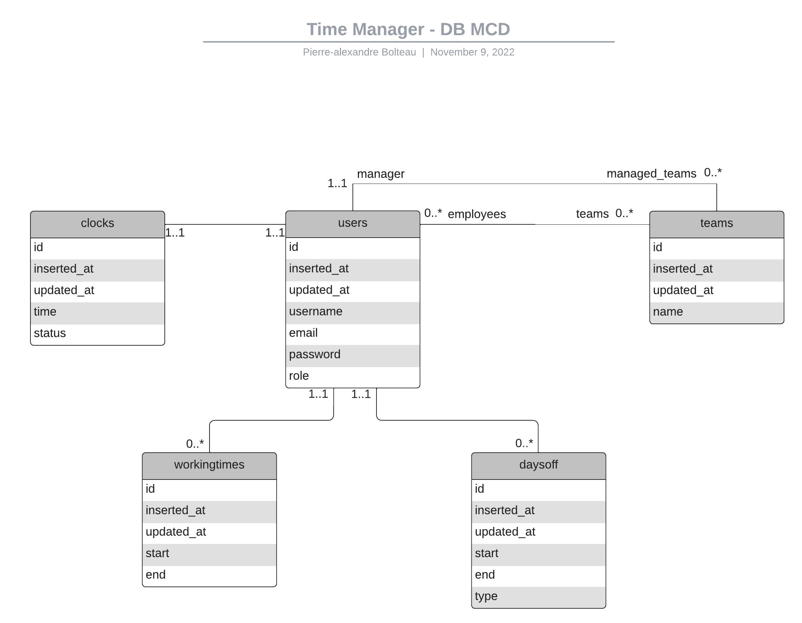

# Backend

To start your Phoenix server for local development:

- Install dependencies with `mix deps.get`
- Create and migrate your database with `mix ecto.setup`
- Start Phoenix endpoint with `mix phx.server` or inside IEx with `iex -S mix phx.server`

To start your Dockerized Phoenix server and Deploy:

- Start Docker Container with `docker compose -f docker-compose.build.yml build && docker compose -f docker-compose.build.yml up`
- To deploy with Travis CI push your changes to git@github.com:RamyFerhat59/timemanager.git
  Now you can visit [`0.0.0.0:4000`](http://0.0.0.0:4000) from your browser locally,
  When deployed visit [`aws load balancer dns name`]

## Database

## Routes

### **1. Sessions**

| Http Methodes | Routes                | Description   | Permissions          | Parameters | Body example                                 |
|---------------|-----------------------|---------------|----------------------|------------|----------------------------------------------|
| POST          | /api/sessions/new     | Log in        | -                    | -          | {"email":"test@gmail.com","password":"test"} |
| POST          | /api/sessions/refresh | Refresh token | must be authenticate | -          | -                                            |
| POST          | /api/sessions/delete  | Log out       | must be authenticate | -          | -                                            |

### **2. Users**

| Http Methodes | Routes         | Description                                         | Permissions                                                | Parameters                            | Body example                                                                      |
|---------------|----------------|-----------------------------------------------------|------------------------------------------------------------|---------------------------------------|-----------------------------------------------------------------------------------|
| GET           | /api/users     | Get all users or get one user by username and email | current user (not for list), manager (not for list), admin | username (optional), email (optional) | -                                                                                 |
| GET           | /api/users/:id | Get user by id                                      | current user, manager, admin                               | -                                     | -                                                                                 |
| POST          | /api/users     | Create user                                         | -                                                          | -                                     | { "user": { "username": "Thomas", "email": "test@bar.com" , "password": "test"} } |
| PUT           | /api/users/:id | Update user by id                                   | current user, manager, admin                               | -                                     | { "user": { "username": "greg", "email": "test2@test.fr" } }                      |
| DELETE        | /api/users/:id | Delete user by id                                   | current user, manager, admin                               | -                                     | -                                                                                 |

### **3. Teams**

| Http Methodes | Routes                 | Description         | Permissions                | Parameters | Body example                              |
|---------------|------------------------|---------------------|----------------------------|------------|-------------------------------------------|
| GET           | /api/teams             | Get all teams       | must be authenticate       | -          | -                                         |
| GET           | /api/teams/:id         | Get team by id      | must be authenticate       | -          | -                                         |
| POST          | /api/teams             | Create user         | manager, admin             | -          | {"team":{"manager_id":"1","name":"test"}} |
| PUT           | /api/teams/:id         | Update team by id   | manager of the team, admin | -          | {"team":{"name":"update_name"}}           |
| PUT           | /api/teams/:id/:userId | Add user to team    | manager of the team, admin | -          | -                                         |
| DELETE        | /api/teams/:id/:userId | Remove user to team | manager of the team, admin | -          | -                                         |
| DELETE        | /api/teams/:id         | Delete team by id   | manager of the team, admin | -          | -                                         |

### **4. Clocks**

| Http Methodes | Routes              | Description                                                                                                | Permissions                  | Parameters | Body example |
|---------------|---------------------|------------------------------------------------------------------------------------------------------------|------------------------------|------------|--------------|
| GET           | /api/clocks/:userId | Get the user's clock by its id                                                                             | current user, manager, admin | -          | -            |
| POST          | /api/clocks/:userId | Post clock or update time and status of the clock. If status is update to false, it creates a working time | current user, manager, admin | -          | -            |

### **5. Workingtimes**

| Http Methodes | Routes                        | Description                                 | Permissions                  | Parameters | Body example                                                                                    |
|---------------|-------------------------------|---------------------------------------------|------------------------------|------------|-------------------------------------------------------------------------------------------------|
| GET           | /api/workingtimes/:userId     | Get user's workingtimes between 2 datetimes | current user, manager, admin | start, end | -                                                                                               |
| GET           | /api/workingtimes/:userId/:id | Get workingtime by id and user id           | current user, manager, admin | -          | -                                                                                               |
| POST          | /api/workingtimes/:userId     | create a workingtime for a user             | current user, manager, admin | -          | {   "workingtime": {     "start": "2021-10-26T00:00:00",     "end": "2021-10-26T23:00:00"   } } |
| PUT           | /api/workingtimes/:id         | update workingtime by id                    | current user, manager, admin | -          | {   "workingtime": {     "start": "2021-10-26T08:03:07"   } }                                   |
| DELETE        | /api/workingtimes/:id         | delete workingtime by id                    | current user, manager, admin | -          | -                                                                                               |

### **6. Days off**

| Http Methodes | Routes                   | Description                            | Permissions                  | Parameters | Body example                                                                                                         |
|---------------|--------------------------|----------------------------------------|------------------------------|------------|----------------------------------------------------------------------------------------------------------------------|
| GET           | /api/daysoff/:userId     | Get user's daysoff between 2 datetimes | current user, manager, admin | start, end | -                                                                                                                    |
| GET           | /api/daysoff/:userId/:id | Get dayoff by id and user id           | current user, manager, admin | -          | -                                                                                                                    |
| POST          | /api/daysoff/:userId     | create a dayoff for a user             | current user, manager, admin | -          | {   "dayoff": {     "start": "2021-10-26T00:00:00",     "end": "2021-10-26T23:00:00",     "type": "sick leave"   } } |
| PUT           | /api/daysoff/:id         | update dayoff by id                    | current user, manager, admin | -          | {   "workingtime": {     "start": "2021-10-26T08:03:07"   } }                                                        |
| DELETE        | /api/daysoff/:id         | delete dayoff by id                    | current user, manager, admin | -          | -                                                                                                                    |

## Learn more

- Official website: https://www.phoenixframework.org/
- Guides: https://hexdocs.pm/phoenix/overview.html
- Docs: https://hexdocs.pm/phoenix
- Forum: https://elixirforum.com/c/phoenix-forum
- Source: https://github.com/phoenixframework/phoenix
